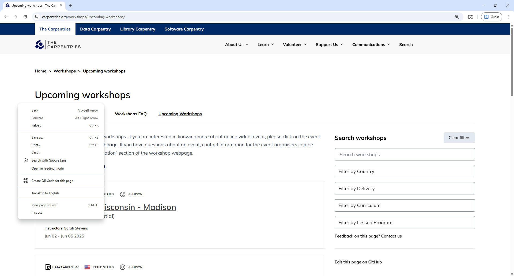

:::::::::::::::::::::::::::::::::::::: questions 

- How do you write a lesson using Markdown and `{sandpaper}`?

::::::::::::::::::::::::::::::::::::::::::::::::

::::::::::::::::::::::::::::::::::::: objectives

- Explain how to use markdown with The Carpentries Workbench
- Demonstrate how to include pieces of code, figures, and nested challenge blocks

::::::::::::::::::::::::::::::::::::::::::::::::

## "Requests" the website HTML

In the previous episode we used a simple HTML document, not an actual website. Now that we move to more real, complex escenario, we need to add another package to our toolbox, the `requests` package. For the purpose of this web scraping lesson, we will only use `requests` to get the HTML behind a website. However, there's a lot of extra functionality that we are not covering but you can find in the [Requests package documentation](https://requests.readthedocs.io/en/latest/).

We'll be scraping The Carpentries website, [https://carpentries.org/](https://carpentries.org/), and specifically, the list of upcoming and past workshop you can find at the bottom. For that, first we'll load the `requests` package and then use the code `.get().text` to store the HTML document of the website. Furthermore, to simplify our navigation through the HTML document, we will use the [Regular Expressions](https://docs.python.org/3/howto/regex.html) `re` module to remove all new line characters ("\n") and their surrounding whitespaces. You can think of removing new lines as a preprocessing or cleaning step, but in this lesson we won't be explaining the intricacies of regular expressions. For that, you can refer to this introductory explanation on the [Library Carpentry](https://librarycarpentry.org/lc-data-intro/01-regular-expressions.html).


```python
import requests
import re
url = 'https://carpentries.org/'
req = requests.get(url).text
cleaned_req = re.sub(r'\s*\n\s*', '', req).strip()
print(cleaned_req[0:1000])
```

```output
<!doctype html><html class="no-js" lang="en"><head><meta charset="utf-8"><meta name="viewport" content="width=device-width, initial-scale=1.0"><title>The Carpentries</title><link rel="stylesheet" type="text/css" href="https://carpentries.org/assets/css/styles_feeling_responsive.css"><script src="https://carpentries.org/assets/js/modernizr.min.js"></script><!-- matomo --><script src="https://carpentries.org/assets/js/matomo-analytics.js"></script><link href="https://fonts.googleapis.com/css?family=Lato:400,400i,700,700i|Roboto:400,400i,700,700i&display=swap" rel="stylesheet"><!-- Search Engine Optimization --><meta name="description" content="The Carpentries is a fiscally sponsored project of Community Initiatives, a registered 501(c)3 non-profit organisation based in California, USA. We are a global community teaching foundational computational and data science skills to researchers in academia, industry and government."><link rel="canonical" href="https://carpentries.org/index.html"><
```

We truncated to print only the first 1000 characters of the document, as it is too long, but we can see it is HTML and has some elements we didn't see in the example of the previous episode, like those identified with the `<meta>`, `<link>` and `<script>` tags.

There's another way to see the HTML document behind a website, directly from your web browser. Using Google Chrome, you can right-click in any part of the website (on a Mac, press and hold the Control key in your keyboard while you click), and from the pop-up menu, click 'View page source', as the next image shows. If the 'View page source' option didn't appear for you, try clicking in another part of the website. A new tab will open with the HTML document for the website you were in.

{alt="A screenshot of The Carpentries homepage in the Google Chrome web browser, showing how to View page source"}

In the HTML page source on your browser you can scroll down and look for the second-level header (`<h2>`) with the text "Upcoming Carpentries Workshops". Or more easily, you can use the Find Bar (Ctrl + F on Windows and Command + F on Mac) to search for "Upcoming Carpentries Workshops". Just right down of that header we have the table element we are interested in, which starts with the opening tag `<table class="table table-striped" style="width: 100%;">`. Inside that element we see nested different elements familiar for a table, the rows (`<tr>`) and the cells for each row (`<td>`), and additionally the image (``) and hyperlink (`<a>`) elements.

## Finding the information we want 

Now, going back to our coding, we left off on getting the HTML behind the website using `requests`, and stored it on the variable called `req`. From here we can proceed with BeautifulSoup as we learned in the previous episode, using the `BeautifulSoup()` function to parse our HTML, as the following code block shows. With the parsed document, we can use the `.find()` or `find_all()` methods to find the table element.

```python
soup = BeautifulSoup(cleaned_req, 'html.parser')
tables_by_tag = soup.find_all('table')
print("Number of table elements found: ", len(tables_by_tag))
print("Printing only the first 1000 characters of the table element: \n", str(tables_by_tag[0])[0:1000])
```

```output
Number of table elements found:  1
Printing only the first 1000 characters of the table element: 
 <table class="table table-striped" style="width: 100%;"><tr><td></td><td><a href="https://galn3x.github.io/-2024-10-28-Metagenomics-online/">Nodo Nacional de Bioinformática UNAM</a><br><b>Instructors:</b> César Aguilar, Diana Oaxaca, Nelly Selem-Mojica<br><b>Helpers:</b> Andreas Chavez, José Manuel Villalobos Escobedo, Aaron Espinosa Jaime, Andrés Arredondo, Mirna Vázquez Rosas-Landa, David Alberto García-Estrada</br></br></img></img></td><td>Oct 28 - Oct 31, 2024</td></tr><tr><td></td><td>
After: <class 'bs4.element.Tag'>
Element type: table
```

## Navigating the tree

If we use the `prettify()` method on the `workshops_table` variable, we see that this table element has a nested tree structure. On the first level is the `<table>` tag. Inside that, we have rows `<tr>`, and inside rows we have table data cells `<td>`. We can start to identify certain information we may be interested in, for example:

- What type of workshop was it ('swc' for Software Carpentry, 'dc' for Data Carpentry, 'lc' for Library Carpentry, and 'cp' for workshops based on The Carpentries curriculum). We find this in the first `<td>` tag, or said in a different way, in the first cell of the row. 
- In what country was the workshop held. We can see the two-letter country code in the second cell of the row.
- The URL to the workshop website, which will contain additional information. It is also contained in the second cell of the row, as the `href` attribute of the `<a>` tag.
- The institution that is hosting the workshop. Also in the second `<td>`, in the text of the hyperlink `<a>` tag.
- The name of instructors and helpers involved in the workshop.
- The dates of the workshop, on the third and final cell.

```python
print(workshops_table.prettify())
```

```output
<table class="table table-striped" style="width: 100%;">
 <tr>
  <td>
   
  </td>
  <td>
   
    
     <a href="https://galn3x.github.io/-2024-10-28-Metagenomics-online/">
      Nodo Nacional de Bioinformática UNAM
     </a>
     <br>
      <b>
       Instructors:
      </b>
      César Aguilar, Diana Oaxaca, Nelly Selem-Mojica
      <br>
       <b>
        Helpers:
       </b>
       Andreas Chavez, José Manuel Villalobos Escobedo, Aaron Espinosa Jaime, Andrés Arredondo, Mirna Vázquez Rosas-Landa, David Alberto García-Estrada
      </br>
     </br>
    </img>
   </img>
  </td>
  <td>
   Oct 28 - Oct 31, 2024
  </td>
 </tr>
 <tr>
  <td>
...
  </td>
 </tr>
</table>
```

To navigate in this HTML document tree we can use the methods `.contents()` (to access direct children nodes), `.parent()` (to access the parent node), `.next_sibling()`, and `.previous_sibling()` (to access the siblings of a node) methods. For example, if we want to access the second row of the table, which is the second child of the table element we could use the following code.

```python
# The second [1 in Python indexing] child of our table element
workshops_table.contents[1]
```

If you go back to the 'View page source' of the website, you'll notice that the table element is nested inside a `<div class="medium-12 columns">` element, which means this `<div>` is the parent of our `<table>`. If we needed to, we could access this parent by using `workshops_table.parent`.

Now imagine we had selected the second data cell of our fifth row using `workshops_table.contents[4].contents[1]`, we could access the third data cell using `.next_sibling()` or the first data cell with `.previous_sibling()`.

```python
# Access the fifth row, and from there, the second data cell
row5_cell2 = workshops_table.contents[4].contents[1]
# Access the third cell of the fifth row
row5_cell3 = row5_cell2.next_sibling
# Access the first cell of the fifth row
row5_cell1 = row5_cell2.previous_sibling
```

Why do we bother to learn all this methods? Depending on you web scraping use case, they might result useful in complex websites. Let's apply them to extract the information we want about the workshops, for example, to see how many upcoming workshops there are, which corresponds with the number of children the table element has

```python
num_workshops = len(workshops_table.contents)
print("Number of upcoming workshops listed: ", num_workshops)
```

Let's work to extract data from only the first row, and later we can use a loop to iterate over all the rows of the table.

```python
# Empty dictionary to hold the data
dict_w = {}

# First row of data
first_row = workshops_table.contents[0]

# To get to the first cell
first_cell = first_row.contents[0]
second_cell = first_cell.next_sibling
third_cell = second_cell.next_sibling

# From the first cell, find the <image> tag and get the 'title' attribute, which contains the type of workshop
dict_w['type'] = first_cell.find('img')['title']

# In the second cell, get the country from the 'title' attribute of the <image> tag
dict_w['country'] = second_cell.find('img')['title']

# Now the link to the workshop website is in the 'href' attribute of the <a> tag
dict_w['link'] = second_cell.find('a')['href']

# The institution that hosts the workshop is the text inside that <a> tag
dict_w['link'] = second_cell.find('a').get_text()

# Get all the text from the second cell
dict_w['all_text'] = second_cell.get_text(strip=True)

# Get the dates from the third cell
dict_w['date'] = third_cell.get_text(strip=True)

print(dict_w)
```

```output
{'type': 'swc workshop',
 'country': 'MX',
 'link': 'https://galn3x.github.io/-2024-10-28-Metagenomics-online/',
 'host': 'Nodo Nacional de Bioinformática UNAM',
 'all_text': 'Nodo Nacional de Bioinformática UNAMInstructors:César Aguilar, Diana Oaxaca, Nelly Selem-MojicaHelpers:Andreas Chavez, José Manuel Villalobos Escobedo, Aaron Espinosa Jaime, Andrés Arredondo, Mirna Vázquez Rosas-Landa, David Alberto GarcÃ\xada-Estrada',
 'date': 'Oct 28 - Oct 31, 2024'}
```

This was just for one row, but we can iterate over all the rows in the table adding a for loop and appending each dictionary to a list. That list will be transformed to a Pandas dataframe so we can see the results nicely.

```python
list_of_workshops = []
for row in range(num_workshops):
	n_row = workshops_table.contents[row]
	first_cell = n_row.contents[0]
	second_cell = first_cell.next_sibling
	third_cell = second_cell.next_sibling
	dict_w = {}
	dict_w['type'] = first_cell.find('img')['title']
	dict_w['country'] = second_cell.find('img')['title']
	dict_w['link'] = second_cell.find('a')['href']
	dict_w['host'] = second_cell.find('a').get_text()
	dict_w['all_text'] = second_cell.get_text(strip=True)
	dict_w['date'] = third_cell.get_text(strip=True)
	list_of_workshops.append(dict_w)

result_df = pd.DataFrame(list_of_workshops)
```

Great! We've finished our first scraping task on a real website. Please be aware that there are multiple ways of achieving the same result. For example, instead of using the `.contents()` method to access the different rows of the table, we could have used `.find_all('tr')` to scan the table and loop through the row elements. Similarly, instead of moving to the siblings of the first data cell, we could have used `.find_all('td')`. Code using that other approach would look like this. Remember, the results are the same!

```python
list_of_workshops = []
for row in workshops_table.find_all('tr'):
	cells = row.find_all('td')
	first_cell = cells[0]
	second_cell = cells[1]
	third_cell = cells[2]
	dict_w = {}
	dict_w['type'] = first_cell.find('img')['title']
	dict_w['country'] = second_cell.find('img')['title']
	dict_w['link'] = second_cell.find('a')['href']
	dict_w['host'] = second_cell.find('a').get_text()
	dict_w['all_text'] = second_cell.get_text(strip=True)
	dict_w['date'] = third_cell.get_text(strip=True)
	list_of_workshops.append(dict_w)

result_df = pd.DataFrame(list_of_workshops)
```


We can obtain the exact same result only using the find_all and find methods


## Automating data collection

Going to the 

When we want to extract information form a website, we need to understand how the website is structured, how we can identify the elements we want


::::::::::::::::::::::::::::::::::::: keypoints 

- Use `.md` files for episodes when you want static content
- Use `.Rmd` files for episodes when you need to generate output
- Run `sandpaper::check_lesson()` to identify any issues with your lesson
- Run `sandpaper::build_lesson()` to preview your lesson locally

::::::::::::::::::::::::::::::::::::::::::::::::

[r-markdown]: https://rmarkdown.rstudio.com/
