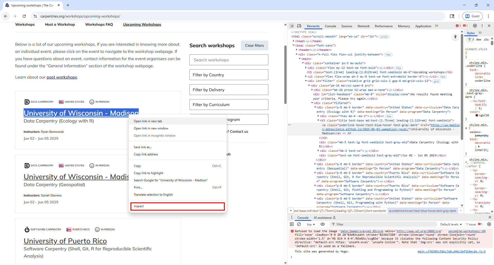

:::::::::::::::::::::::::::::::::::::: questions 

- How can I get the data and information from a real website?
- How can I start automating my web scraping tasks?

::::::::::::::::::::::::::::::::::::::::::::::::

::::::::::::::::::::::::::::::::::::: objectives

- Use the `requests` package to get the HTML document behind a website.
- Navigate the tree structure behind an HTML document to extract the information we need.
- Know how to avoid being blocked by sending too much requests to a website.

::::::::::::::::::::::::::::::::::::::::::::::::

It's now time to extract information from an actual website, [https://carpentries.org](https://carpentries.org), where we'll recover all upcoming and past workshops taught by The Carpentries global community.
To give you a few ideas of how web scraping is useful in this case, we could use this data to analyze which countries have had more workshops, or build a frequently updated dashboard with recent trends in instruction, or to build an app that notifies us when there's a new workshop offered in our country.

Using the basic tools shown here, you could build similar apps and analyses with the website(s) of your interest.
But always remember the code of conduct described in the previous episode, especially the first point - there's a chance you can get the data you want more easily.
In the example we're going to work on now, there's a [list of The Carpentries data feeds](https://feeds.carpentries.org/full_list.html) that you can use to get upcoming and past workshops.

## "Requests" the website HTML

In the previous episode we used a simple HTML document, not an actual website.
Now that we move to more real, complex scenario, we need to add another package to our toolbox, the `requests` package.
For the purpose of this web scraping lesson, we will only use `requests` to get the HTML behind a website.
However, there's a lot of extra functionality that we are not covering but you can find in the [Requests package documentation](https://requests.readthedocs.io/en/latest/).

We'll be scraping The Carpentries website, and specifically, the list of [upcoming](https://carpentries.org/workshops/upcoming-workshops/) and [past workshops](https://carpentries.org/workshops/past-workshops/).
For that, first we'll load the `requests` package and then use the code `.get().text` to store the HTML document of the website.
Furthermore, to simplify our navigation through the HTML document, we will use the [Regular Expressions](https://docs.python.org/3/howto/regex.html) `re` module to remove all new line characters ("\n") and their surrounding white spaces.
You can think of removing new lines as a pre-processing or cleaning step, but in this lesson we won't be explaining the intricacies of regular expressions.
For that, you can refer to this introductory explanation on the [Library Carpentry](https://librarycarpentry.org/lc-data-intro/01-regular-expressions.html).


```python
import requests
import re
from bs4 import BeautifulSoup
from time import sleep

url = 'https://carpentries.org/workshops/upcoming-workshops/'
req = requests.get(url).text
cleaned_req = re.sub(r'\s*\n\s*', '', req).strip()
print(cleaned_req[0:1000])
```

```output
<!doctype html><html class=scroll-smooth lang=en-us dir=ltr><head><meta charset=utf-8><meta name=viewport content="width=device-width"><title>Upcoming workshops | The Carpentries</title><link rel=preconnect href=https://fonts.googleapis.com><link rel=preconnect href=https://fonts.gstatic.com crossorigin><link href="https://fonts.googleapis.com/css2?family=Mulish:ital,wght@0,200..1000;1,200..1000&display=swap" rel=stylesheet><script defer src=https://cdn.jsdelivr.net/npm/@glidejs/glide@3.5.x></script><script src=https://kit.fontawesome.com/3a6fac633d.js crossorigin=anonymous></script><link rel=stylesheet href=https://cdn.datatables.net/1.13.6/css/jquery.dataTables.min.css><script src=https://code.jquery.com/jquery-3.7.1.min.js></script><script src=https://cdn.datatables.net/1.13.6/js/jquery.dataTables.min.js></script><script src=https://cdn.jsdelivr.net/npm/moment@2.29.1/moment.min.js></script><script src=https://cdn.datatables.net/plug-ins/1.13.6/sorting/datetime-moment.js></script><sc
```

We truncated to print only the first 1000 characters of the document, as it is too long, but we can see it is HTML and has some elements we didn't see in the example of the previous episode, like those identified with the `<meta>`, `<link>` and `<script>` tags.

There's another way to see the HTML document behind a website, directly from your web browser. Using Google Chrome, you can right-click in any part of the website (on a Mac, press and hold the Control key in your keyboard while you click), and from the pop-up menu, click 'View page source', as the next image shows.
If the 'View page source' option didn't appear for you, try clicking in another part of the website. A new tab will open with the HTML document for the website you were in.

{alt="A screenshot of The Carpentries upcoming workshops website in the Google Chrome web browser, showing how to View page source"}

In the HTML page source on your browser you can scroll down and look for the first-level header (`<h1>`) with the text "Upcoming workshops". Or more easily, you can use the Find Bar (Ctrl + F on Windows and Command + F on Mac) to search for "Upcoming workshops".
If you read from there and compare it to the rendered website, you'll see how the content is formatted from the raw HTML, using tags like unordered lists (`<ul>`), list items (`<li>`), paragraphs (`<p>`), and content divisions (`<div>`).

## Finding the information we want

However, it would take you a long while of carefully reading the HTML to understand the page structure and where to find the data on workshops.
In this case, there's another useful tool available in web browsers called "Inspect".
You can select an element of the website, right-click on top of it (on a Mac, press and hold the Control key in your keyboard while you click), and from the pop-up menu, click 'Inspect'.
We'll do that with the first item in the 'Upcoming workshops' list, as this screenshot shows.
(You may see a different workshop as the first item as the website is updated frequently.)

{alt="A screenshot of Google Chrome web browser, showing how to use Inspect from the Chrome DevTools"}

Using the "Inspect" feature opens DevTools on the side of your browser, offering other features for inspecting, debugging, and analyzing web pages in real-time.
For this workshop, however, we’ll focus on just the "Elements" tab.
If you selected the organization name to Inspect, as shown in the screenshot, in the "Elements" tabs you'll see highlighted an hyperlink element, between `<a>` tags.
Around it, as its parent, you'll see a third-level header with `<h3>` tags.
As mentioned in the previous episode, here you can notice the tree structure of the HTML, where elements can have children or have a parent.

Going back to our coding, we left off on getting the HTML behind the website using `requests`, and stored it on the variable called `req`.
From here we can proceed with BeautifulSoup as we learned in the previous episode, using the `BeautifulSoup()` function to parse our HTML, as the following code block shows.
With the parsed document, we can use the `.find()` or `find_all()` methods to find all third-level headers.

```python
soup = BeautifulSoup(cleaned_req, 'html.parser')
h3_by_tag = soup.find_all('h3')
print("Number of h3 elements found: ", len(h3_by_tag))
for n, h3 in enumerate(h3_by_tag):
    print(f"Workshop #{n} - {h3.get_text()}")
```

Besides searching elements using tags, sometimes it will be useful to search using attributes, like `id` or `class`.
For example, we can see the `h3` elements have a class attribute with multiple values "title text-base md:text-[1.75rem] leading-[2.125rem] font-semibold", which identifies all possible elements with similar styling. Therefore, we could have the same result than before using the `class_` argument on the `.find_all()` method as follows.

```python
h3_by_class = soup.find_all(class_="title text-base md:text-[1.75rem] leading-[2.125rem] font-semibold")
```

## Navigating the tree

Going back to our web browser and in the "Inspect" tool, can you identify what is the parent of the first `h3` element?
If you said, a content division element (with `<div>` tag), you are right!
But exactly which `div` as there are so many in this website?
Again, we can identify elements also by its class, which in this case is "p-8 mb-5 border".

We can also find the parent with the help of BeautifulSoup.
For this, we use `.parent` property of any "bs4.element.Tag" object with the following code

STOPPED HERE TO CONTINUE WORKING LATER

To navigate in this HTML document tree we can use the following properties of the "bs4.element.Tag" object: `.contents` (to access direct children nodes), `.parent` (to access the parent node), `.next_sibling`, and `.previous_sibling` (to access the siblings of a node) methods. For example, if we want to access the second row of the table, which is the second child of the table element we could use the following code.

```python
# The second [1 in Python indexing] child of our table element
workshops_table.contents[1]
```

If you go back to the 'View page source' of the website, you'll notice that the table element is nested inside a `<div class="medium-12 columns">` element, which means this `<div>` is the parent of our `<table>`. If we needed to, we could access this parent by using `workshops_table.parent`.

Now imagine we had selected the second data cell of our fifth row using `workshops_table.contents[4].contents[1]`, we could access the third data cell using `.next_sibling()` or the first data cell with `.previous_sibling()`.

```python
# Access the fifth row, and from there, the second data cell
row5_cell2 = workshops_table.contents[4].contents[1]
# Access the third cell of the fifth row
row5_cell3 = row5_cell2.next_sibling
# Access the first cell of the fifth row
row5_cell1 = row5_cell2.previous_sibling
```

Why do we bother to learn all this methods? Depending on you web scraping use case, they might result useful in complex websites. Let's apply them to extract the information we want about the workshops, for example, to see how many upcoming workshops there are, which corresponds with the number of children the table element has

```python
num_workshops = len(workshops_table.contents)
print("Number of upcoming workshops listed: ", num_workshops)
```

Let's work to extract data from only the first row, and later we can use a loop to iterate over all the rows of the table.

```python
# Empty dictionary to hold the data
dict_w = {}

# First row of data
first_row = workshops_table.contents[0]

# To get to the first cell
first_cell = first_row.contents[0]
second_cell = first_cell.next_sibling
third_cell = second_cell.next_sibling

# From the first cell, find the <image> tag and get the 'title' attribute, which contains the type of workshop
dict_w['type'] = first_cell.find('img')['title']

# In the second cell, get the country from the 'title' attribute of the <image> tag
dict_w['country'] = second_cell.find('img')['title']

# Now the link to the workshop website is in the 'href' attribute of the <a> tag
dict_w['link'] = second_cell.find('a')['href']

# The institution that hosts the workshop is the text inside that <a> tag
dict_w['link'] = second_cell.find('a').get_text()

# Get all the text from the second cell
dict_w['all_text'] = second_cell.get_text(strip=True)

# Get the dates from the third cell
dict_w['date'] = third_cell.get_text(strip=True)

print(dict_w)
```

```output
{'type': 'swc workshop',
 'country': 'MX',
 'link': 'https://galn3x.github.io/-2024-10-28-Metagenomics-online/',
 'host': 'Nodo Nacional de Bioinformática UNAM',
 'all_text': 'Nodo Nacional de Bioinformática UNAMInstructors:César Aguilar, Diana Oaxaca, Nelly Selem-MojicaHelpers:Andreas Chavez, José Manuel Villalobos Escobedo, Aaron Espinosa Jaime, Andrés Arredondo, Mirna Vázquez Rosas-Landa, David Alberto GarcÃ\xada-Estrada',
 'date': 'Oct 28 - Oct 31, 2024'}
```

This was just for one row, but we can iterate over all the rows in the table adding a for loop and appending each dictionary to a list. That list will be transformed to a Pandas dataframe so we can see the results nicely.

```python
list_of_workshops = []
for row in range(num_workshops):
	n_row = workshops_table.contents[row]
	first_cell = n_row.contents[0]
	second_cell = first_cell.next_sibling
	third_cell = second_cell.next_sibling
	dict_w = {}
	dict_w['type'] = first_cell.find('img')['title']
	dict_w['country'] = second_cell.find('img')['title']
	dict_w['link'] = second_cell.find('a')['href']
	dict_w['host'] = second_cell.find('a').get_text()
	dict_w['all_text'] = second_cell.get_text(strip=True)
	dict_w['date'] = third_cell.get_text(strip=True)
	list_of_workshops.append(dict_w)

result_df = pd.DataFrame(list_of_workshops)
```

Great! We've finished our first scraping task on a real website. Please be aware that there are multiple ways of achieving the same result. For example, instead of using the `.contents()` method to access the different rows of the table, we could have used `.find_all('tr')` to scan the table and loop through the row elements. Similarly, instead of moving to the siblings of the first data cell, we could have used `.find_all('td')`. Code using that other approach would look like this. Remember, the results are the same!

```python
list_of_workshops = []
for row in workshops_table.find_all('tr'):
	cells = row.find_all('td')
	first_cell = cells[0]
	second_cell = cells[1]
	third_cell = cells[2]
	dict_w = {}
	dict_w['type'] = first_cell.find('img')['title']
	dict_w['country'] = second_cell.find('img')['title']
	dict_w['link'] = second_cell.find('a')['href']
	dict_w['host'] = second_cell.find('a').get_text()
	dict_w['all_text'] = second_cell.get_text(strip=True)
	dict_w['date'] = third_cell.get_text(strip=True)
	list_of_workshops.append(dict_w)

upcomingworkshops_df = pd.DataFrame(list_of_workshops)
```

A key takeaway from this exercise is that, when we want to scrape data in a structured way, we have to spend some time getting to know how the website is structured and how we can identify and extract only the elements we are interested in.

::::::::::::::::::::::::::::::::::::: challenge

Extract the same information as in the previous exercise, but this time from the Past Workshops Page at [https://carpentries.org/past_workshops/](https://carpentries.org/past_workshops/). Which 5 countries have held the most workshops, and how many has each held?

:::::::::::::::::::::::: solution

We can reuse directly the code we wrote before, changing only the URL we got the HTML from.

```python
url = 'https://carpentries.org/past_workshops/'
req = requests.get(url).text
cleaned_req = re.sub(r'\s*\n\s*', '', req).strip()

soup = BeautifulSoup(cleaned_req, 'html.parser')
workshops_table = soup.find('table')

list_of_workshops = []
for row in workshops_table.find_all('tr'):
	cells = row.find_all('td')
	first_cell = cells[0]
	second_cell = cells[1]
	third_cell = cells[2]
	dict_w = {}
	dict_w['type'] = first_cell.find('img')['title']
	dict_w['country'] = second_cell.find('img')['title']
	dict_w['link'] = second_cell.find('a')['href']
	dict_w['host'] = second_cell.find('a').get_text()
	dict_w['all_text'] = second_cell.get_text(strip=True)
	dict_w['date'] = third_cell.get_text(strip=True)
	list_of_workshops.append(dict_w)

pastworkshops_df = pd.DataFrame(list_of_workshops)

print('Total number of workshops in the table: ', len(pastworkshops_df))

print('Top 5 of countries by number of workshops held: \n',
      pastworkshops_df['location'].value_counts().head())
```

```output
Total number of workshops in the table:  3830
Top 5 of countries by number of workshops held: 
 country
US    1837
GB     468
AU     334
CA     225
DE     172
Name: count, dtype: int64
```

:::::::::::::::::::::::::::::::::

::::::::::::::::::::::::::::::::::::::::::::::::


::::::::::::::::::::::::::::::::::::: challenge

For a more challenging exercise, try to add to our output dataframe if the workshop was held online or not.

You'll notice from the website that the online workshops have a world icon next between the country flag and the name of the institution that hosts the workshop. 

:::::::::::::::::::::::: solution

To start, we can see in the HTML document that the world icon is in the second data cell of a row. Additionally, for those workshops that are online, there is an additional image element with these attributes ``. So we could search if the second data cell has an element with an attribute of `title="Online"`. If it doesn't, the `.find()` method would return nothing, what in Python is called a "NoneType" data type. So if `.find()` returns None, we should fill the respective cell in our dataframe with a "No", meaning that the workshop not held online, and in the opposite case fill it with a "Yes". Here is a possible code solution, which you would add to the previous code where we extracted the other data and created the dataframe.

```python
if second_cell.find(title="Online") == None:
  online_value = "No"
else:
  online_value = "Yes"
dict_w['online'] = online_value
```

:::::::::::::::::::::::::::::::::

::::::::::::::::::::::::::::::::::::::::::::::::

## Automating data collection

Until now we've only scraped one website at a time. But there may be situations where the information you need will be split in different pages, or where you have to follow a trace of hyperlinks. With the tools we've learned until now, this new task is straightforward. We would have to add a loop that goes to those other pages, gets the HTML document using the `requests` package, and parses the HTML with `BeautifulSoup` to extract the required information. 

The additional and important step to consider in this task is to add a wait time between each request to the website, so we don't overload the web server that is providing us the information we need. If we send too many requests in a short period of time, we can prevent other “normal” users from accessing the site during that time, or even cause the server to run out of resources and crash. If the provider of the website detects an excessive use, it could block our computer from accessing that website, or even take legal action in extreme cases.

To make sure we don't crash the server, we can add a wait time between each step of our loop with the built-in Python module `time` and its `sleep()` function. With this function, Python will wait for the specified number of seconds before continuing to execute the next line of code. For example, when you run the following code, Python will wait 10 seconds between each print execution.

```python
from time import sleep
print('First')
sleep(10)
print('Second')
```

Let's incorporate this important principle for extracting additional information from each of our workshop websites in the upcoming list. We already have our `upcomingworkshops_df` dataframe, and in there, a `link` column with the URL to the website for each individual workshop. For example, let's make a request for the HTML of the first workshop in the dataframe, and take a look.

```python
first_url = upcomingworkshops_df.loc[0, 'link']
print("URL we are visiting: ", first_url)

req = requests.get(first_url).text
cleaned_req = re.sub(r'\s*\n\s*', '', req).strip()

soup = BeautifulSoup(cleaned_req, 'html.parser')
print(soup.prettify())
```

If we explore the HTML this way, or using the 'View page source' in the browser, we notice something interesting in the `<head>` element. As this information is inside `<head>` instead of the `<body>` element, it won't be displayed in our browser when we visit the page, but the meta elements will provide metadata for search engines to better understand, display, and index the page. Each of this `<meta>` tags contain useful information for our table of workshops, for example, a well formatted start and end date, the exact location of the workshop with latitude and longitude (for those not online), the language in which it will be taught, and a more structured way of listing instructors and helpers. Each of these data points can be identified by the the "name" attribute in the `<meta>` tags, and the information we want to extract is the value in the "content" attribute.

The following code automates the process of getting this data from each website, for the first five workshops in our `upcomingworkshops_df` dataframe. We will only do it for five workshops to not send too many requests overwhelming the server, but we could also do it for all the workshops.

```python
# List of URLs in our dataframe
urls = list(upcomingworkshops_df.loc[:5, 'link'])

# Start an empty list to store the different dictionaries with our data
list_of_workshops = []

# Start a loop over each URL
for item in tqdm(urls):
    # Get the HTML and parse it
    req = requests.get(item).text
    cleaned_req = re.sub(r'\s*\n\s*', '', req).strip()
    soup = BeautifulSoup(cleaned_req, 'html.parser')

    # Start an empty dictionary and fill it with the URL, which
    # is our identifier with our other dataframe
    dict_w = {}
    dict_w['link'] = item

    # Use the find function to search for the <meta> tag that 
    # has each specific 'name' attribute and get the value in the
    # 'content' attribute
    dict_w['startdate'] = soup.find('meta', attrs = {'name': 'startdate'})['content']
    dict_w['enddate'] = soup.find('meta', attrs = {'name': 'enddate'})['content']
    dict_w['language'] = soup.find('meta', attrs = {'name': 'language'})['content']
    dict_w['latlng'] = soup.find('meta', attrs = {'name': 'latlng'})['content']
    dict_w['instructor'] = soup.find('meta', attrs = {'name': 'instructor'})['content']
    dict_w['helper'] = soup.find('meta', attrs = {'name': 'helper'})['content']

    # Append to our list
    list_of_workshops.append(dict_w)

    # Be respectful, wait at least 3 seconds before a new request
    sleep(3)

extradata_upcoming_df = pd.DataFrame(list_of_workshops)
```

::::::::::::::::::::::::::::::::::::: challenge

It is possible that you received an error when executing the previous block code, and the most probable reason is that the URL your tried to visit didn't exist. This is known as 404 code error, that indicates the requested page doesn't exist, or more precisely, it cannot be found on the server. What would be your approach to work around this possible error?

:::::::::::::::::::::::: solution

A Pythonic crude way of working around any error for a given URL would be to use a [try and except block](https://docs.python.org/3/tutorial/errors.html), for which you would ignore any URL that throws an error and continue with the next one.

A more stylish way to deal when a web page doesn't exist is to get the actual response code when `requests` tries to reach the page. If you receive a 200 code, it means the request was successful. In any other case, you'd want to store the code and skip the scraping of that page. The code you'd use to get the response code is:

```python
req = requests.get(url)
print(req.status_code)
```

:::::::::::::::::::::::::::::::::

::::::::::::::::::::::::::::::::::::::::::::::::


::::::::::::::::::::::::::::::::::::: keypoints 

- We can get the HTML behind any website using the "requests" package and the function `requests.get('website_url').text`.
- An HTML document is a nested tree of elements. Therefore, from a given element, we can access its child, parent, or sibling, using `.contents`, `.parent`, `.next_sibling`, and `previous_sibling`.
- It's polite to not send too many requests to a website in a short period of time. For that, we can use the `sleep()` function of the built-in Python module `time`. 

::::::::::::::::::::::::::::::::::::::::::::::::

[r-markdown]: https://rmarkdown.rstudio.com/
