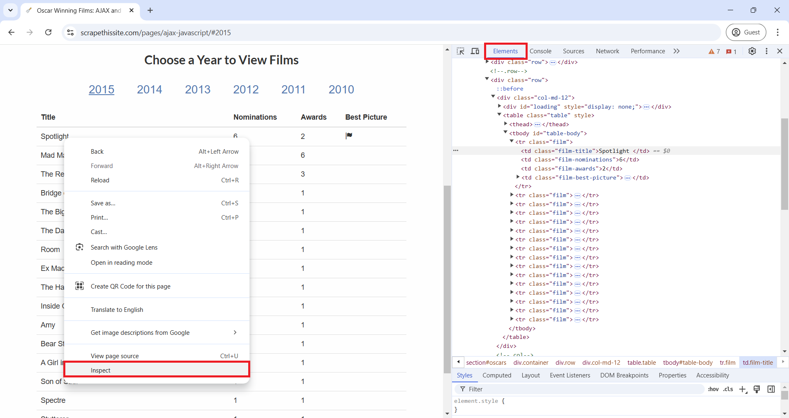
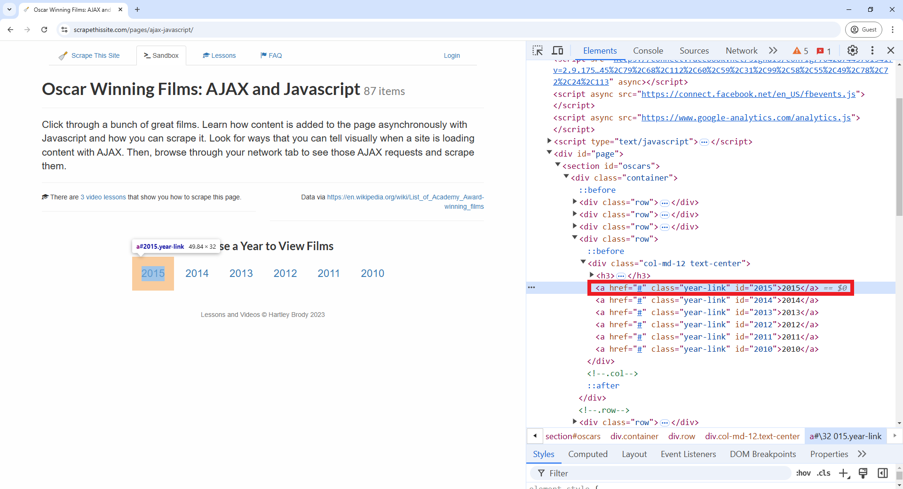

:::::::::::::::::::::::::::::::::::::: questions 

- What are the differences between static and dynamic websites?
- Why is it important to understand these differences when doing web scraping?
- How can I start my own web scraping project?

::::::::::::::::::::::::::::::::::::::::::::::::

::::::::::::::::::::::::::::::::::::: objectives

- Use the `Selenium` package to scrape dynamic websites.
- Identify the elements of interest using the browser's "Inspect" tool.
- Understand the usual pipeline of a web scraping project.

::::::::::::::::::::::::::::::::::::::::::::::::

## You see it but the HTML doesn't have it!

Visit the following webpage created by Hartley Brody for the purpose of learning and practicing web scraping: [https://www.scrapethissite.com/pages/ajax-javascript/](https://www.scrapethissite.com/pages/ajax-javascript/) (read first the [terms of use](https://www.scrapethissite.com/faq/)). Select "2015" to see that year's Oscar winning films. Now look at the HTML behind it as we've learned, using the "View page source" tool on your browser or in Python using the requests and BeautifulSoup packages. Can you find in any place of the HTML the best picture winner "Spotlight"? Can you find any other of the movies or the data from the table? If you can't, how could you scrape this page?

When you explore a page like this, you'll notice that the movie data, including the title "Spotlight," isn’t actually in the initial HTML source. This is because the website uses JavaScript to load the information dynamically. JavaScript is a programming language that runs in your browser, allowing websites to fetch, process, and display content on the fly, often based on user actions like clicking a button. When you select "2015", the browser executes JavaScript (called by one of the `<script>` elements you see in the HTML) to retrieve the relevant movie information from the web server and build a new HTML document with actual information in the table. This makes the page feel more interactive, but it also means the initial HTML you see doesn’t contain the movie data itself.

Let’s explore a new way to view HTML elements in your browser to better understand the differences in an HTML document before and after JavaScript is executed. On the Oscar winners page you just visited, right-click (or Control key + Click on Mac) and select "Inspect" from the pop-up menu, as shown in the image below. This opens DevTools on the side of your browser, offering a range of features for inspecting, debugging, and analyzing web pages in real-time. For this workshop, however, we’ll focus on just the "Elements" tab. In the "Elements" tab, you’ll see an HTML document that actually includes the table element, unlike what you saw in "View Page Source". This difference is because "View Page Source" displays the original HTML, before any JavaScript is run, while "Inspect" reveals the HTML as it appears after JavaScript has executed.

{alt="A screenshot of Google Chrome web browser, showing how to use Inspect from the Chrome DevTools"}

As the `requests` package retrieves the source HTML, we need a different approach to scrape these types of websites. For this, we will use the `Selenium` package. But don't forget about the "Inspect" tool we just learned, it will be handy when scraping.

## Using Selenium to scrape dynamic websites

[Selenium](https://www.selenium.dev/) is an open source project for web browser automation. It will be useful for our scraping tasks as it will act as a real user interacting with a webpage in a browser. This way, Selenium will render pages in a browser environment, allowing JavaScript to load dynamic content, and therefore giving us access to the website HTML after JavaScript has executed. Additionally, this package simulates real user interactions like filling in text boxes, clicking, scrolling, or selecting drop-down menus, which will be useful when we scrape dynamic websites.

To use it, we'll load "webdriver" and "By" from the `selenium` package. webdriver open or simulate a web browser, interacting with it based on the instructions we give. By will allow us to specify how we will select a given element in the HTML, by tag (using "By.TAG_NAME") or by attributes like class ("By.CLASS_NAME"), id ("By.ID"), or name ("By.NAME"). We will also load the other packages we used in the previous episode.

```python
from bs4 import BeautifulSoup
import pandas as pd
from time import sleep
from selenium import webdriver
from selenium.webdriver.common.by import By
```

Selenium can simulate multiple multiple browsers like Chrome, Firefox, Safari, etc. For now, we'll use Chrome. When you run the following line of code, you'll notice that a Google Chrome window opens up. Don't close it, as this is how Selenium interacts with the browser. Later we'll see how to do *headless* browser interactions, headless meaning that browser interactions will happen in the background, without opening a new browser window or user interface.

```python
driver = webdriver.Chrome()
```

Now, to tell the browser to visit our Oscar winners page, use the `.get()` method on the `driver` object we just created.

```python
driver.get("https://www.scrapethissite.com/pages/ajax-javascript/")
```

How can we direct Selenium to click the text "2015" for the table of that year tho show up? First, we need to find that element, in a similar way to how we find elements with BeautifulSoup. Just like we used `.find()` in BeautifulSoup to find the first element that matched the specified criteria, in Selenium we have `.find_element()`. Likewise, as we used `.find_all()` in BeautifulSoup to return a list of all coincidences for our search criteria, we can use `.find_elements()` in Selenium. But the syntax of how we specify the search paramenters will be a little different.

If we wanted to search a table element that has the `<table>` tag, we would run `driver.find_element(by=By.TAG_NAME, value="table")`. If we wanted to search an element with a specific value in the "class" attribute, for example an element like `<tr class="film">` we would run `driver.find_element(by=By.CLASS_NAME, value="film")`. To know what element we need to click to open "2015" table of Oscar winners we can use the "Inspect" tool (remember you can do this in Google Chrome by pointing your mouse over the "2015" value, make a right-click, and select "Inspect" from the pop-up menu). In the DevTools window, you'll see element `<a href="#" class="year-link" id="2015">2015</a>`. As the ID attribute is unique for only one element in the HTML, we can directly select the element by this attribute using the code you'll find after the following image.

{alt="A screenshot of Google Chrome web browser, showing how to search a specific element by using Inspect from the Chrome DevTools"}


```python
button_2015 = driver.find_element(by=By.ID, value="2015")
```

We've located the hyperlink element we want to click to get the table for that year, and on that element we will use the `.click()` method to interact with it. As the table takes a couple of seconds to load, we will also use the `sleep()` function from the "time" module to wait will the JavaScript runs and the table loads. Then, we use `driver.page_source` for Selenium to get the HTML document from the website, and we store it in a variable called `html_2015`. Finally, we close the web browser that Selenium was using with `driver.quit()`.

```python
button_2015.click()
sleep(3)
html_2015 = driver.page_source
driver.quit()
```

Importantly, the HTML document we stored in `html_2015` **is the HTML after the dynamic content loaded**, so it will contain the table values for 2015 that weren't there originally and that we wouldn't be able to see if we had used the `requests` package instead.

We could continue using Selenium and its `.find_element()` and `.find_elements()` methods to to extract our data of interest. But instead, we will use BeautifulSoup to parse the HTML and find elements, as we already have some practice using it. If we search for the first element with class attribute equal to "film-title" and return the text inside it, we see that this HTML has the "Spotlight" movie.

```python
soup = BeautifulSoup(html_2015, 'html.parser')
print(soup.find(class_='film').prettify())
```
```python
<tr class="film">
 <td class="film-title">
  Spotlight
 </td>
 <td class="film-nominations">
  6
 </td>
 <td class="film-awards">
  2
 </td>
 <td class="film-best-picture">
  <i class="glyphicon glyphicon-flag">
  </i>
 </td>
</tr>
```

The following code repeats the process of clicking and loading the 2015 data, but now using "headless" mode (i.e. without opening a browser window). Then, it extracts data from the table one column at a time, taking advantage that each column has a unique class attribute that identifies it. Instead of using for loops to extract data from each element that `.find_all()` finds, we use list comprehensions. You can learn more about them reading [Python's documentation for list comprehensions](https://docs.python.org/3/tutorial/datastructures.html#list-comprehensions), or with this [Programiz short tutorial](https://www.programiz.com/python-programming/list-comprehension).

```python
# Create the Selenium webdriver and make it headless
options = ChromeOptions()
options.add_argument("--headless=new")
driver = webdriver.Chrome(options=options)

# Load the website. Find and click 2015. Get post JavaScript execution HTML. Close webdriver
driver.get("https://www.scrapethissite.com/pages/ajax-javascript/")
button_2015 = driver.find_element(by=By.ID, value="2015")
button_2015.click()
sleep(3)
html_2015 = driver.page_source
driver.quit()

# Parse HTML using BeautifulSoup and extract each column as a list of values ising list comprehensions
soup = BeautifulSoup(html_2015, 'html.parser')
titles_lc = [elem.get_text() for elem in soup.find_all(class_="film-title")]
nominations_lc = [elem.get_text() for elem in soup.find_all(class_="film-nominations")]
awards_lc = [elem.get_text() for elem in soup.find_all(class_="film-awards")]

# For the best picture column, we can't use .get_text() as there is no text
# Rather, we want to see if there is an <i> tag
best_picture_lc = ["Yes" if elem.find("i") == None else "No" for elem in soup.find_all(class_="film-best-picture")]

# Create a dataframe based on the previous lists
movies_2015 = pd.DataFrame(
    {'titles': titles_lc, 'nominations': nominations_lc, 'awards': awards_lc, 'best_picture': best_picture_lc}
)
```

::::::::::::::::::::::::::::::::::::: challenge

Based on what we've learned in this episode, write code for getting the data of all the years from 2010 to 2015 of [Hartley Brody's website](https://www.scrapethissite.com/pages/ajax-javascript/) with information of Oscar Winning Films. Hint: You'll use the same code, but add loop through each year.

:::::::::::::::::::::::: solution

Besides adding a loop for each year, the following solution is refactoring the code by creating two functions: one that finds and clicks a year returning the html after the data shows up, and another that gets the html and parses it to extract the data and create a dataframe.

So you can see the process of how Selenium opens the browser and clicks the years, we are not adding the "headless" option.

```python
# Function to search year hyperlink and click it
def findyear_click_gethtml(year):
    button = driver.find_element(by=By.ID, value=year)
    button.click()
    sleep(3)
    html = driver.page_source
    return html

# Function to parse html, extract table data, and assign year column
def parsehtml_extractdata(html, year):
    soup = BeautifulSoup(html, 'html.parser')
    titles_lc = [elem.get_text() for elem in soup.find_all(class_="film-title")]
    nominations_lc = [elem.get_text() for elem in soup.find_all(class_="film-nominations")]
    awards_lc = [elem.get_text() for elem in soup.find_all(class_="film-awards")]
    best_picture_lc = ["No" if elem.find("i") == None else "Yes" for elem in soup.find_all(class_="film-best-picture")]
    movies_df = pd.DataFrame(
        {'titles': titles_lc, 'nominations': nominations_lc, 'awards': awards_lc, 'best_picture': best_picture_lc, 'year': year}
    )
    return movies_df

# Open Selenium webdriver and go to the page
driver = webdriver.Chrome()
driver.get("https://www.scrapethissite.com/pages/ajax-javascript/")

# Create empty dataframe where we will append/concatenate the dataframes we get for each year
result_df = pd.DataFrame()

for year in ["2010", "2011", "2012", "2013", "2014", "2015"]:
    html_year = findyear_click_gethtml(year)
    df_year = parsehtml_extractdata(html_year, year)
    result_df = pd.concat([result_df, df_year])

# Close the browser that Selenium opened
driver.quit()
```

:::::::::::::::::::::::::::::::::

::::::::::::::::::::::::::::::::::::::::::::::::


::::::::::::::::::::::::::::::::::::: challenge

If you are tired of scraping table data like we've been doing for the last two episodes, here is another dynamic website exercise where you can practice what you've learned. Go to [this product page](https://www.scrapingcourse.com/javascript-rendering) created by scrapingcourse.com and extract all product names and prices, and also the hyperlink that each product card has to a detailed view page.

When you complete that, and if you are up to an additional challenge, scrape from the detailed view page of each product its SKU, Category and Description.

:::::::::::::::::::::::: solution

To identify what elements containt the data you need, you should use the "Inspect" tool in your browser. The following image is a screenshot of the website. In there we can see that each product card is a `<div>` element with multiple attributes that we can use to narrow down our search to the specific elements we want. For example, we would use `'data-testid'='product-item'`. After we find all *divs* that satisfy that condition, we can extract from each the hyperlink, the name, and the price. The hyperlink is the 'href' attribute of the `<a>` tag. The name and price are inside `<span>` tags, and we could use multiple attributes to get each of them. In the following code, we will use `'class'='product-name'` to get the name and `'data-content'='product-price'` to get the price.

{alt="A screenshot of Google Chrome web browser, highlighting the `<div>` element that contains the data we want about the product"}

```python
# Open Selenium webdriver in headless mode and go to the desired page
options = webdriver.ChromeOptions()
options.add_argument("--headless=new")
driver = webdriver.Chrome(options=options)
driver.get("https://www.scrapingcourse.com/javascript-rendering")

# As we don't have to click anything, just wait for the JavaScript to load, we can get the HTML right away
sleep(3)
html = driver.page_source

# Parste the HTML
soup = BeautifulSoup(html, 'html.parser')
# Find all <div> elements that have a 'data-testid' attribute with the value of 'product-item'
divs = soup.find_all("div", attrs = {'data-testid': 'product-item'})

# Loop through the <div> elements we found, and for each get the href,
# the name (inside a <span> element with attribute class="product-name")
# and the price (inside a <span> element with attribute data-content="product-price"
list_of_dicts = []
for div in divs:
    # Create a dictionary to store the data we want for each product
    item_dict = {
        'link': div.find('a')['href'],
        'name': div.find('span', attrs = {'class': 'product-name'}).get_text(),
        'price': div.find('span', attrs = {'data-content': 'product-price'}).get_text()
    }
    list_of_dicts.append(item_dict)

all_products = pd.DataFrame(list_of_dicts)
```

We could arrive to the same result if we replace the for loop with list comprehensions. So here is another possible solution with that approach.

```python
links = [elem['href'] for elem in soup.find_all('a', attrs = {'class': 'product-link'})]
names = [elem.get_text() for elem in soup.find_all('span', attrs = {'class': 'product-name'})]
prices = [elem.get_text() for elem in soup.find_all('span', attrs = {'data-content': 'product-price'})]
all_products_v2 = pd.DataFrame(
    {'link': links, 'name': names, 'price': prices}
)
```

:::::::::::::::::::::::::::::::::

::::::::::::::::::::::::::::::::::::::::::::::::

## The scraping pipeline

By now, you've learned about the core tools for web scraping: requests, BeautifulSoup, and Selenium. These three tools form a versatile pipeline for almost any web scraping task. When starting a new scraping project, there are several important steps to follow that will help ensure you capture the data you need.

The first step is **understanding the website structure**. Every website is different and structures data in its own particular way. Spend some time exploring the site and identifying the HTML elements that contain the information you want. Next, **determine if the content is static or dynamic**. Static content can be directly accessed from the HTML source code using requests and BeautifulSoup, while dynamic content often requires Selenium to load JavaScript on the page before BeautifulSoup can parse it.

Once you know how the website presents its data, **start building your pipeline**. If the content is static, make a `requests` call to get the HTML document, and use `BeautifulSoup` to locate and extract the necessary elements. If the content is dynamic, use `Selenium` to load the page fully, perform any interactions (like clicking or scrolling), and then pass the rendered HTML to `BeautifulSoup` for parsing and extracing the necessary elements. Finally, **format and store the data** in a structured way that's useful for your specific project and that makes it easy to analyse later.

This scraping pipeline helps break down complex scraping tasks into manageable steps and allows you to adapt the tools based on the website’s unique features. With practice, you’ll be able to efficiently combine these tools to extract valuable data from almost any website.


::::::::::::::::::::::::::::::::::::: keypoints 

- Dynamic websites load content using JavaScript, which isn't present in the initial or source HTML. It's important to distinguish between static and dynamic content when planning your scraping approach.
- The `Selenium` package and its `webdriver` module simulate a real user interacting with a browser, allowing it to execute JavaScript and clicking, scrolling or filling in text boxes.
- Here are the commandand we learned when we use `Selenium`:
  - `webdriver.Chrome()` # Start the Google Chrome browser simulator
  - `.get("website_url")` # Go to a given website
  - `.find_element(by, value)` and `.find_elements(by, value)` # Get a given element
  - `.click()` # Click the element selected
  - `.page_source` # Get the HTML after JavaScript has executed, which can later be parsed with BeautifulSoup
  - `.quit()` # Close the browser simulator
- The browser's "Inspect" tool allows users to view the HTML document after dynamic content has loaded, revealing elements added by JavaScript. This tool helps identify the specific elements you are interested in scraping.
- A typical scraping pipeline involves understanding the website's structure, determining content type (static or dynamic), using the appropriate tools (requests and BeautifulSoup for static, Selenium and BeautifulSoup for dynamic), and structuring the scraped data for analysis.
::::::::::::::::::::::::::::::::::::::::::::::::

[r-markdown]: https://rmarkdown.rstudio.com/
